# SA Command

<p align="center">
  
</p>

<p align="center">
  <strong>Operational software for running a production company as one connected system.</strong>
</p>

<p align="center">
  
  
  
  
  
  
  
  
</p>

---

## 1. What SA Command Actually Is

SA Command is production-style internal software engineered for the operational reality of **SA Productions**. It is not a demonstration CRUD dashboard or a generic enterprise template.

Production companies rarely operate inside one tidy application. Instead, day-to-day operations fracture across:

- Spreadsheets for crew and equipment
- Disconnected WhatsApp groups for scheduling and call times
- Ad-hoc calendar invites
- Excel financial workbooks and personal notes
- Separate billing files and paper receipts
- Mental accounting and verbal commitments

The fundamental challenge is not having too few screens. The challenge is:

> **Operational information should not be duplicated. It should remain connected to the thing it describes.**

A production must not exist as one row in a job list, an isolated set of names in a chat, equipment jotted in a notebook, tasks in a separate todo app, advance payments in an owner's personal ledger, and billing records in another tool. 

In SA Command:

> **Enter operational information once. Keep it connected. Let the system carry context everywhere else.**

```text
                         ┌───────────────────────┐
                         │       SA COMMAND      │
                         │   Operational Truth   │
                         └───────────┬───────────┘
                                     │
          ┌──────────────────────────┼──────────────────────────┐
          │                          │                          │
          ▼                          ▼                          ▼
       PEOPLE                      WORK                   PRODUCTIONS
   employees / roles         tasks / progress          jobs / crew / dates
          │                          │                          │
          └──────────────────────────┼──────────────────────────┘
                                     │
                                     ▼
                              HEADQUARTERS
                         equipment / inventory
                         availability / booking
                                     │
                                     ▼
                                  FINANCE
                       contracts / receipts / expenses
                       payroll / invoices / settlements
                                     │
                                     ▼
                                   BILLING
                                     │
                                     ▼
                                    EVE
                          operational intelligence
```

Every domain remains responsible for its own canonical state. The platform links them without creating duplicate business truth.

---

## 2. The Operating Model

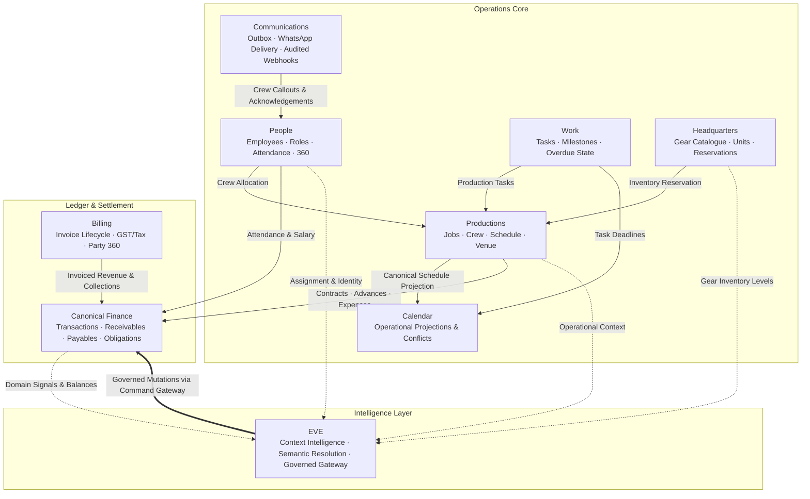

### Domain Map

| Domain | Owns | Connects To |
|---|---|---|
| **People** | Employee records, roles, daily attendance, leaves, base compensation | Productions (crew), Finance (obligations & payouts), Comms (callouts) |
| **Work** | Operational tasks, assignees, priorities, status (`TODO`, `IN_PROGRESS`, `DONE`) | Productions (attached tasks), Calendar (deadlines), Command (overdue queue) |
| **Productions** | Event titles, clients, dates, schedules, venues, operational notes | People (crew), HQ (equipment reservations), Finance (contracts & advances) |
| **Headquarters** | Master catalogue, serialized units, bulk stock, warehouse reservations | Productions (assigned gear), Finance (asset purchases & vendor invoices) |
| **Finance** | Double-entry transaction journal, receivables, payables, owner positions | Productions (contracts/receipts), People (payroll), Billing (settlement) |
| **Billing** | Invoices, draft $\to$ issued $\to$ paid lifecycle, GST rates, PDF exports | Finance (invoice receivables & collections), Parties (commercial counterparty) |
| **Calendar** | Canonical temporal intervals, attendee availability, conflict detection | Productions (events), Work (task deadlines), Meetings (sessions) |
| **Communications** | Transactional outbox, template variables, WhatsApp provider abstraction | People (crew broadcast & message delivery receipts) |
| **EVE** | Natural-language grounding, context session, semantic resolution, suggestions | Canonical domain services, Command Gateway, PostgreSQL System of Record |

---

## 3. Command Dashboard

The Command Dashboard serves as the owner's operational control surface. It is designed around operational truth rather than vanity analytics.

It answers the vital morning questions:
- *What is happening today?*
- *Which productions require attention right now?*
- *What work is overdue?*
- *What money moved and what remains outstanding?*
- *Which employees are involved?*
- *Which workflow should be opened next?*

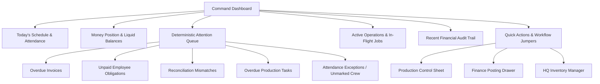

> [!IMPORTANT]
> The Command Dashboard **never** uses artificial intelligence to invent operational severity. Attention items are deterministically computed from underlying invariants (due dates, unposted reconciliations, unpaid balances, and crew conflicts). Clicking an item routes the operator directly into the authoritative domain workflow.

---

## 4. Productions: One Intake, Connected Everywhere

A production in SA Command is a central operational object rather than an isolated database entry. Through a single intake, the operator registers:

1. **Production Core**: Title, client name, event date, venue, priority, and operational notes.
2. **Schedule**: Call time, start time, wrap time (projected transactionally into `calendar_events`).
3. **Crew Allocation**: Assigned members and operational roles (projected into `production_members` with conflict checking).
4. **Task Breakdown**: Production-scoped tasks with assignees and due dates (created in `tasks`).
5. **Equipment Requirements**: Warehouse gear reservations (idempotently reserved in `hq_reservations`).
6. **Commercial Terms**: Initial contract value and client advance payment (posted into canonical `finance_transactions`).

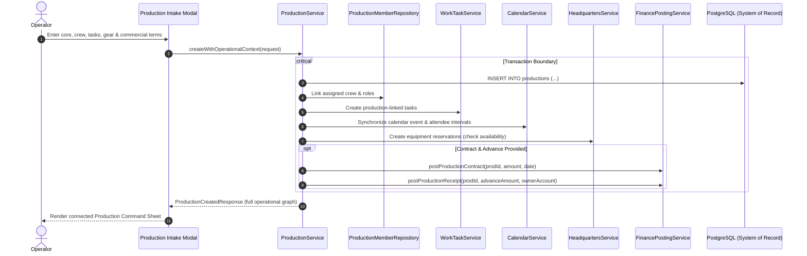

The resulting Production Sheet acts as the job's command center: crew status, equipment readiness, task completion curves, financial settlement progress, and live schedule updates—all coordinated through canonical domain APIs.

---

## 5. People & Employee 360

People is not a flat address book. It is structured around an **Employee 360** model that connects identity, daily operations, scheduling, and finance.

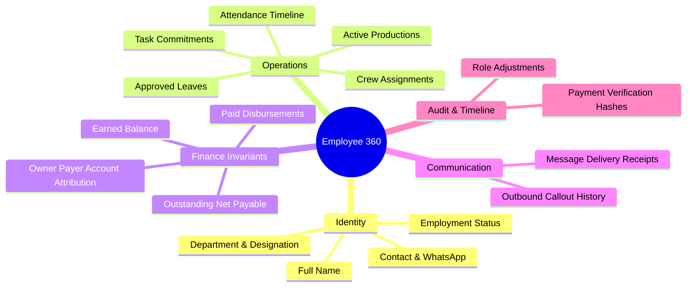

### The Central Financial Invariant

$$\text{Earned} \neq \text{Paid} \neq \text{Outstanding}$$

In real operations, an employee's earning obligation and the physical disbursement of funds are distinct events.
- **Earned**: Canonical accruals based on contracted work, verified attendance, bonuses, or overtime.
- **Paid**: Append-only disbursements recorded in the ledger with explicit method, timestamp, and owner account attribution (`AZ-2` / `AK-2`).
- **Outstanding**: Net calculated balance ($\max(\text{Earned} - \text{Paid}, 0)$).

Employee payments support partial payments and repeated installments. Every payout transaction is an immutable record protected by database uniqueness constraints and explicit owner attribution.

---

## 6. Work & Headquarters

### Work Domain
Work translates operational planning into accountable execution. Tasks exist independently or link to productions and meetings:
- Tasks enforce status transitions: `TODO` $\to$ `IN_PROGRESS` $\to$ `COMPLETED` (or `CANCELLED`).
- Deadlines synchronize transactionally with the central Calendar.
- Overdue tasks automatically feed the Command Dashboard Attention Queue.

### Headquarters & Equipment Domain
Equipment is managed as real inventory, not decorative text labels on a job sheet.

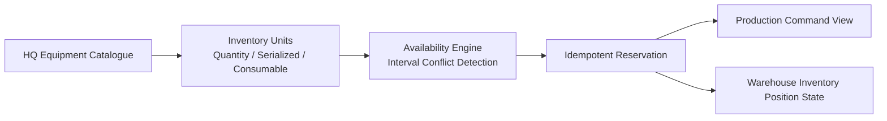

- **Stock Modes**: Supports bulk quantity items (e.g. C-stands, flight cases), serialized high-value gear (cameras, cinema lenses), and consumables (gaffer tape, batteries).
- **Availability & Reservations**: When gear is requested for a production, `HeadquartersService` evaluates warehouse positions across the date interval. 
- **Idempotent Reservations**: Linking gear creates structured `hq_reservations` records. Retrying an assignment preserves existing reservations without double-counting warehouse stock.

---

## 7. Canonical Finance

Finance is the most strictly controlled domain in SA Command. The platform enforces an absolute distinction between **historical business evidence** and **canonical financial truth**.

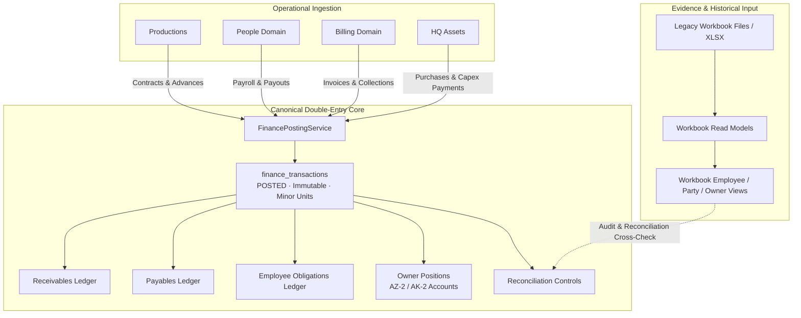

### Financial Rules & Architectural Distinctions

The financial engine strictly preserves real-world accounting semantics:

| Operational Distinction | Architectural Guarantee |
|---|---|
| **Earned $\neq$ Paid** | Accrual obligations and cash payouts are distinct ledger postings. |
| **Invoice $\neq$ Direct Party Charge** | Direct client charges and formal GST tax invoices have separate settlement pipelines; they are never combined into duplicate revenue. |
| **Invoice Payment $\neq$ Direct Charge Settlement** | Direct receipts settle direct party receivables; invoice payments clear formal invoice balances. |
| **Equipment Assignment $\neq$ Equipment Purchase** | Reserving gear for a production does not create capital expenditures. |
| **Equipment Purchase $\neq$ Equipment Payment** | Receiving vendor equipment creates an accounts-payable liability; payment clears the liability via an owner account. |
| **Contract $\neq$ Receipt** | Production contract value establishes expected billing/receivable; client advance establishes liquid cash received. |
| **Billing Export $\neq$ Money Posting** | Generating a PDF invoice is an artifact event; only a confirmed payment transaction alters the cash journal. |

### Canonical Finance Ledger Surfaces

| Area | Purpose & Accounting Semantics |
|---|---|
| **Productions** | Contracts (`PRODUCTION_CONTRACT`), client advances (`PRODUCTION_RECEIPT`), direct shoot expenses, margin tracking |
| **Employees** | Period payroll accruals, bonus/overtime adjustments, payouts (`EMPLOYEE_PAYMENT`), owner payer attribution |
| **Parties** | Counterparty balances, direct charges, counterparty receipts, commercial status |
| **Billing** | Draft $\to$ Issued $\to$ Paid tax invoice lifecycle, GST itemization, partial payment tracking |
| **Equipment** | Capital equipment acquisition bills (`EQUIPMENT_PURCHASE`) and disbursements (`EQUIPMENT_PAYMENT`) |
| **Owners** | Azeem (`AZ-2`) and Akash (`AK-2`) capital positions, inter-owner transfers, and account reimbursement |
| **Reconciliation** | Cross-verification between legacy workbook read models and canonical PostgreSQL postings |
| **Workbook Views** | Read-only historical evidence models for auditing transition integrity |

---

## 8. Party 360 & Billing

Counterparties (clients, corporate vendors, agencies) interact through two distinct commercial settlement tracks. SA Command never collapses these into a single bucket.

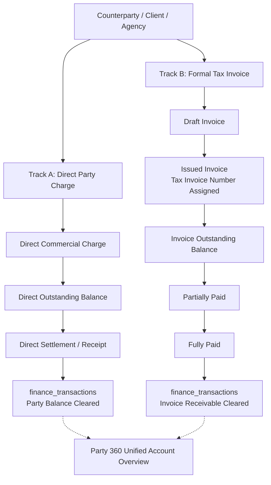

- **Direct Charge Track**: Used for straightforward project settlements, rapid advances, and direct counterparty transactions without formal tax documentation.
- **Formal Invoice Track**: Governs the official billing lifecycle (`DRAFT` $\to$ `ISSUED` $\to$ `PARTIALLY_PAID` $\to$ `PAID` / `CANCELLED`), enforcing immutable invoice sequences, tax rate tables, and client GST details.
- **Party 360 Console**: Aggregates total counterparty exposure, active productions, direct balances, and open formal invoices in a single view while keeping underlying transactions separate.

---

## 9. EVE — The Intelligence Layer

EVE is the contextual command and intelligence core of SA Command. It is **not** an ungrounded chatbot layered over database queries.

```text
                 ┌─────────────────────┐
                 │        MAMU         │
                 │   Human Authority   │
                 └──────────┬──────────┘
                            │
                            ▼
                    ┌───────────────┐
                    │      EVE      │
                    │ Intelligence  │
                    └───────┬───────┘
                            │
             ┌──────────────┼──────────────┐
             │              │              │
             ▼              ▼              ▼
         LANGUAGE        CONTEXT       RETRIEVAL
        UNDERSTANDING   INTELLIGENCE    & MEMORY
             │              │              │
             └──────────────┼──────────────┘
                            ▼
                   INFORMATION NEED
                            │
                            ▼
                  CAPABILITY RESOLUTION
                            │
                            ▼
                   CANONICAL SERVICES
                            │
                            ▼
                       POSTGRESQL
```

### The Architectural Axiom

> **Qwen interprets language. EVE reasons over system context. PostgreSQL remains the truth.**

EVE completely rejects naive keyword matching or direct LLM-to-SQL generation:

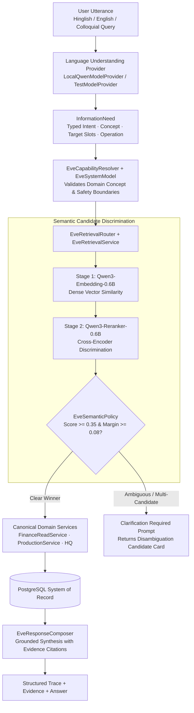

### What EVE Is vs. What It Is Not

```
┌──────────────────────────────────────────────────────────────────────────────────┐
│                             ARCHITECTURAL SEPARATION                             │
├─────────────────────────────────────────────────┬────────────────────────────────┤
│ WHAT IT IS NOT                                  │ WHAT IT IS                     │
├─────────────────────────────────────────────────┼────────────────────────────────┤
│ A second ERP or secondary ledger                │ An operational intelligence    │
│                                                 │ layer over canonical services  │
├─────────────────────────────────────────────────┼────────────────────────────────┤
│ An unrestricted autonomous agent                │ A deterministic, policy-bound  │
│                                                 │ assistant                      │
├─────────────────────────────────────────────────┼────────────────────────────────┤
│ An LLM with direct database credentials        │ An interpreter that resolves   │
│                                                 │ typed InformationNeeds         │
├─────────────────────────────────────────────────┼────────────────────────────────┤
│ An ad-hoc SQL generator                         │ A caller of audited canonical  │
│                                                 │ domain APIs                    │
├─────────────────────────────────────────────────┼────────────────────────────────┤
│ Cloud-dependent SaaS telemetry                  │ 100% offline, local-first      │
│                                                 │ inference via llama.cpp        │
├─────────────────────────────────────────────────┼────────────────────────────────┤
│ Arbitrary background executor                   │ Two-phase governed execution:  │
│                                                 │ Propose -> Confirm -> Verify   │
└─────────────────────────────────────────────────┴────────────────────────────────┘
```

---

## 10. EVE System Model & Context Intelligence

EVE maintains an internal schema of the organization's concepts, relationships, and capabilities (`EveSystemModel`). It navigates business relationships rather than merely searching strings.

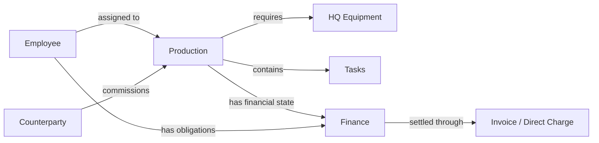

### Conversational Context & Multi-Turn Grounding

EVE maintains a bounded session context (`EveContextEngine`) containing:
- Active production focus
- Active employee focus
- Pending clarification prompts
- Referenced entity memory slots
- Recent conversational turns
- Grounded citations and database primary keys

#### Real-World Example: Multi-Turn Grounding

```text
User: "crew for sharma wedding"
 EVE: Evaluates candidates -> Finds multiple productions matching "Sharma"
      "I found multiple productions matching 'Sharma'. Which one?
       1. Sharma Wedding Sangeet (2026-10-15)
       2. Sharma Corporate Gala (2026-10-22)"

User: "wedding wala"
 EVE: Resolves pending clarification
      -> Focus affinity selects "Sharma Wedding Sangeet"
      -> Resumes original intent (READ_PRODUCTION_CREW)
      -> Fetches canonical records from ProductionMemberRepository
      -> Grounded response:
      "Sharma Wedding Sangeet has 4 assigned crew members:
       - Raj Sharma (Lead Cinematographer)
       - Priya Patel (Camera Operator)
       - Vikram Singh (Gaffer)
       - Aman Verma (Sound Recordist)"
```

---

## 11. Local-First AI Architecture

EVE is designed from the ground up for **zero cloud dependency, zero external data leakage, and offline reliability**. All intelligence runs on local hardware using native runtimes.

```text
SA Command
    │
    ▼
EVE Intelligence Layer
    │
    ├── Language Model (Local llama.cpp)
    │       ↓
    │     Qwen 2.5 / Qwen 3 (GGUF, Quantized)
    │
    ├── Semantic Retrieval (Port 8087)
    │       ↓
    │     Qwen3-Embedding-0.6B (Dense Vectors, Cosine Metric)
    │
    ├── Candidate Discrimination (Port 8088)
    │       ↓
    │     Qwen3-Reranker-0.6B (Cross-Encoder Attention)
    │
    └── Canonical Retrieval
            ↓
        PostgreSQL System of Record
```

### Local AI Components

- **Runtime**: Native `llama-server.exe` processes running on Windows hardware (validated on 12GB RAM, 4GB VRAM GPU configurations).
- **Dense Vector Embedding**: `Qwen3-Embedding-0.6B-Q8_0.gguf` computes dense representation vectors for semantic search.
- **Cross-Encoder Reranking**: `Qwen3-Reranker-0.6B-Q8_0.gguf` scores query-to-candidate relevance using cross-attention, enabling reliable discrimination across severe typos, Hinglish phrases (*"mips wala event"*), and relational descriptors (*"Kabir wala shoot"*).
- **Semantic Caching**: Thread-safe in-memory vector cache (`EveSemanticCache`) with automatic invalidation on canonical entity updates or text hash drift. Zero secondary vector databases required.
- **Test Providers**: Deterministic in-memory providers (`TestEmbeddingProvider`, `TestRerankerProvider`, `TestModelProvider`) run during Maven test cycles and offline CI without external binary dependencies.

---

## 12. Governed Execution: The Safe Mutation Boundary

EVE is never allowed to directly execute business mutations or write to financial tables. All write operations follow a strict **Two-Phase Governed Execution** protocol.

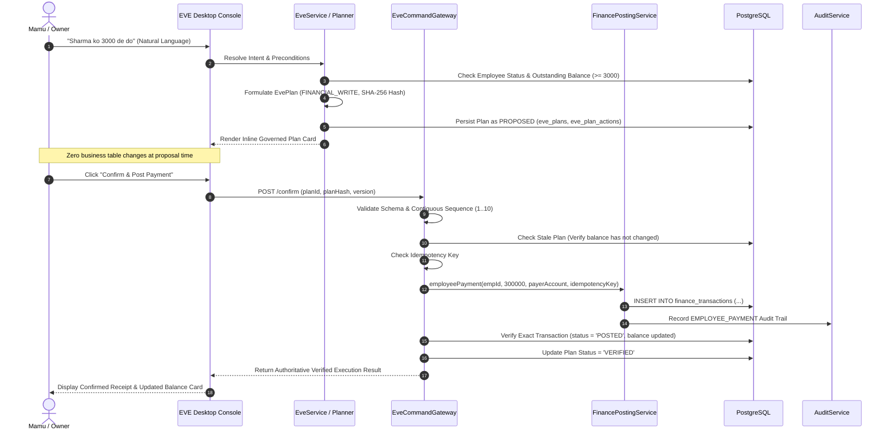

### Safeguards Enforced by `EveCommandGateway`

1. **Finite Command Registry**: Only explicit, pre-registered commands (`POST_EMPLOYEE_PAYMENT`) can execute. Unregistered commands fail schema validation.
2. **Cryptographic Plan Hashing**: Every plan receives a SHA-256 hash computed over its plan ID, version, intent, risk tier, and sorted canonical parameters (`EvePlanHasher`). Confirmations must supply the exact matching hash.
3. **Stale Plan Detection**: If the underlying entity state (such as payable balance or account status) changes between plan generation and confirmation, execution is rejected with `STALE_PLAN`.
4. **Idempotency Enforcement**: Every proposed action carries a unique UUID idempotency key enforced at the database level (`uq_eve_plan_actions_idempotency_key` and `finance_transactions.idempotency_key`).
5. **Post-Write Verification**: An operation is marked `VERIFIED` only after directly querying PostgreSQL to confirm the transaction status is `POSTED`, balance impacts occurred, and audit records were created.

---

## 13. Continuous Intelligence & Evidence-Backed Suggestions

EVE acts as an active observer across canonical system events. When business mutations occur, EVE processes the domain signal and synthesizes evidence-backed suggestions for the owner.

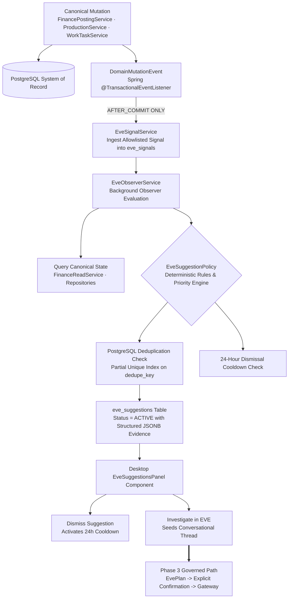

### Observation Invariants

- **Observation $\neq$ Authority**: Suggestions **never** trigger autonomous mutations. They appear as inspectable cards in the desktop UI.
- **`AFTER_COMMIT` Isolation**: Signals are ingested strictly after database commit. If a transaction rolls back, zero signals and zero suggestions are produced.
- **Inspectable Evidence**: Every suggestion carries an evidence payload linking each data point to its authoritative source table and primary key.
- **Auto-Resolution**: When an underlying condition naturally clears (e.g. an overdue invoice is settled or a task is finished), the observer automatically marks the suggestion `RESOLVED`.

---

## 14. Safety & System Authority Model

SA Command maintains an uncompromising boundary regarding where authority resides:

```text
┌───────────────────────────────────────────────────────────┐
│                    NATURAL LANGUAGE                       │
│             English · Hinglish · Colloquial               │
└──────────────────────────┬────────────────────────────────┘
                           │
                           ▼
┌───────────────────────────────────────────────────────────┐
│                    EVE / LOCAL AI                         │
│                                                           │
│ Interpretation · Context · Retrieval · Planning           │
└──────────────────────────┬────────────────────────────────┘
                           │
                           ▼
┌───────────────────────────────────────────────────────────┐
│                  POLICY / COMMAND GATEWAY                 │
│                                                           │
│ Validation · Authorization · Idempotency · Freshness       │
└──────────────────────────┬────────────────────────────────┘
                           │
                           ▼
┌───────────────────────────────────────────────────────────┐
│                 CANONICAL DOMAIN SERVICES                 │
│                                                           │
│ ProductionService · FinancePostingService · HQ · Work     │
└──────────────────────────┬────────────────────────────────┘
                           │
                           ▼
┌───────────────────────────────────────────────────────────┐
│                     POSTGRESQL                            │
│                  SYSTEM OF RECORD                         │
└───────────────────────────────────────────────────────────┘
```

### Authority Matrix

| Concern | Authoritative Source |
|---|---|
| **Employee truth** | People domain (`employees`, `attendance`, `payroll`) |
| **Production truth** | Production domain (`productions`, `production_members`) |
| **Task truth** | Work domain (`tasks`, `task_updates`) |
| **Equipment & stock truth** | Headquarters (`hq_equipment`, `hq_inventory_positions`, `hq_reservations`) |
| **Financial truth** | Canonical Finance (`finance_transactions`, double-entry journal) |
| **Invoice truth** | Billing domain (`invoices`, `invoice_items`) |
| **Database truth** | PostgreSQL (System of Record) |
| **Language understanding** | Local Qwen runtime (interpretation only, zero business authority) |
| **Semantic candidate discovery** | Bounded local vector embeddings & cross-encoder rerankers |
| **Conversational session state** | EVE session context engine |
| **Mutation validation** | Governed Command Gateway (schema, hashing, stale check, idempotency) |
| **Post-write verification** | Canonical PostgreSQL verification engine |
| **Material execution authority** | The human owner / operator (explicit confirmation required) |

---

## 15. Testing & Verification Philosophy

SA Command follows a rigorous verification culture where operations that impact money, inventory, and production commitments must be provably correct.

```mermaid
flowchart LR
    CHANGE[Code Change] --> UNIT[Focused Unit Tests]
    UNIT --> TESTC[PostgreSQL Testcontainers]
    TESTC --> REGRESS[Domain & Financial Regression]
    REGRESS --> SEC[EVE Security Boundary Tests]
    SEC --> DESK[Desktop Component Tests]
    DESK --> BUILD[Typecheck & Vite Production Build]
    BUILD --> AUDIT[Semantic Business Rule Audit]
    AUDIT --> REL[Controlled Release]
```

### Test Coverage Areas

- **Canonical Finance Mutations**: Tested against real PostgreSQL instances via Testcontainers to verify double-entry balance arithmetic, allocation tracking, and rollback isolation.
- **Idempotency & Concurrency**: Validates that network retries and duplicate request UUIDs cannot produce duplicate financial transactions.
- **Stale-Plan Prevention**: Proves that mid-flight balance changes invalidate pending proposal hashes, preventing out-of-date writes.
- **EVE Security Boundaries**: Validates that prompt injection attempts in transaction descriptions, entity notes, and user prompts are treated strictly as inert string data.
- **Conversational Regression**: Multi-turn dialogue tests evaluate pronoun resolution, session context preservation, and candidate disambiguation.
- **Local Model Integration**: Real native inference tests for Qwen models alongside fast deterministic test suites for offline CI.
- **Desktop Component Suites**: Vitest and React Testing Library suites evaluate modal workflows, state rendering, and accessibility.

---

## 16. Engineering Principles

1. **One Source of Truth**: Never create a secondary ledger, shadow balance cache, or duplicate database simply to satisfy a new interface.
2. **Domain Ownership**: Each domain strictly owns its database tables, lifecycle rules, and transaction boundaries.
3. **Explicit Mutations**: All business modifications pass through domain services; raw database edits outside domain boundaries are prohibited.
4. **Idempotency**: Retrying an operation with the same request token must return the previous result without duplicating business side effects.
5. **Post-Write Verification**: For material operations, a successful HTTP `200` is insufficient; the platform directly verifies the resulting database state.
6. **AI Boundaries**: AI interprets language, retrieves records, and proposes structured plans; it never commands business authority or writes direct SQL.
7. **Human Authority**: The owner remains the sole authority for material financial and operational mutations.
8. **Evidence Over Inference**: Ground all system outputs in authoritative PostgreSQL evidence rather than model generation.

---

## 17. Technology Stack

### Backend
- **Language**: Java 21 (LTS)
- **Framework**: Spring Boot 3.4+ (Web, Security, Validation, Data JPA)
- **Database**: PostgreSQL 16+
- **Database Migrations**: Flyway (append-only migrations)
- **Testing**: JUnit 5, Mockito, AssertJ, Testcontainers PostgreSQL

### Desktop & Frontend
- **Runtime**: Tauri 2 (Rust stable desktop container, OS credential vault integration)
- **Framework**: React 19, TypeScript 5+
- **Build Tool**: Vite
- **Server State**: TanStack Query (React Query)
- **UI State**: Zustand (restricted to theme, modals, and shell state)
- **Command Menu**: cmdk (`SACommandPalette`)
- **Styling**: Tailwind CSS, original local CSS design system
- **Motion**: Motion (reduced-motion compliant, layout transitions)
- **Icons**: Lucide React (single consistent icon family)

### Local Intelligence (EVE)
- **Local LLM Engine**: llama.cpp (`llama-server.exe`) running Qwen quantized models
- **Dense Vector Embedding**: `Qwen3-Embedding-0.6B-Q8_0.gguf`
- **Cross-Encoder Reranker**: `Qwen3-Reranker-0.6B-Q8_0.gguf`
- **Orchestration**: Java-native cognitive runtime, deterministic test providers for CI

---

## 18. Design Language

SA Command deliberately avoids generic enterprise dashboard templates, bright neon palettes, and noisy data tables. The visual design is tailored for focus and operational clarity:

- **Themes**: SA Pearl (off-white, high-legibility default) and Reference Charcoal (deep studio dark mode).
- **Surfaces**: Very large radii, thin low-contrast borders, minimal drop shadows, and subtle spotlight card hovers.
- **Motion**: macOS-inspired staged physical motion; full support for `prefers-reduced-motion`.
- **Information Architecture**: Bento grid layouts, detached icon dock, floating top segmented navigation, and quick-action drawers.

> *The interface should feel expensive. The workflow should feel obvious.*

---

## 19. Repository Structure

```text
sa-controlcentre/
│
├── apps/
│   ├── backend/                         # Spring Boot 3.4 application
│   │   ├── src/main/java/com/saproduction/command/
│   │   │   ├── attendance/              # Attendance & leave management
│   │   │   ├── audit/                   # Auditing & DomainMutationEvent bus
│   │   │   ├── auth/                    # Opaque session tokens & security
│   │   │   ├── billing/                 # Invoice lifecycle & GST models
│   │   │   ├── calendar/                # Canonical interval & conflict scheduling
│   │   │   ├── communication/           # Outbox pattern & WhatsApp delivery
│   │   │   ├── employee/                # Employee management & 360 models
│   │   │   ├── eve/                     # EVE intelligence core & gateway
│   │   │   │   ├── capability/          # CapabilityResolver & InformationNeed
│   │   │   │   ├── cognitive/           # Cognitive tools & reasoning runtime
│   │   │   │   ├── semantic/            # Embeddings, rerankers, cache & policy
│   │   │   │   └── system/              # EveSystemModel concepts & domains
│   │   │   ├── finance/                 # Canonical posting, read & workbook services
│   │   │   ├── headquarters/            # Equipment inventory & reservations
│   │   │   ├── payroll/                 # Minor-unit salary & payout ledger
│   │   │   ├── production/              # Production core, crew & single intake
│   │   │   └── work/                    # Tasks & operational assignments
│   │   ├── src/main/resources/
│   │   │   ├── db/migration/            # Flyway SQL migrations (V001..V031)
│   │   │   └── application.yml
│   │   └── pom.xml
│   │
│   └── desktop/                         # React 19 + TypeScript + Tauri 2 application
│       ├── src/
│       │   ├── components/layout/       # AppShell, Dock, CommandPalette
│       │   ├── features/                # Domain UI features
│       │   │   ├── command/             # Command Dashboard
│       │   │   ├── productions/         # Production management & single intake
│       │   │   ├── employees/           # Employee 360 & attendance
│       │   │   ├── headquarters/        # Gear inventory & stock manager
│       │   │   ├── finance/             # Canonical ledger & workbook views
│       │   │   ├── billing/             # Invoices & Party 360
│       │   │   ├── calendar/            # Schedule-X calendar integration
│       │   │   └── eve/                 # EVE conversational console & suggestions
│       │   └── styles/                  # Design system tokens & CSS rules
│       ├── src-tauri/                   # Rust desktop wrapper & credential store
│       └── package.json
│
├── docs/                                # Project documentation & technical specs
│   ├── architecture.md                  # Core system architecture
│   ├── data-model.md                    # Database schema specifications
│   ├── payroll.md                       # Payroll policies & integer minor units
│   ├── security.md                      # Authentication, tokens & secret policies
│   ├── release.md                       # Packaging & release guides
│   ├── whatsapp.md                      # Communications & webhook specs
│   └── THIRD_PARTY.md                   # Third-party dependencies & provenance
│
├── eve/                                 # EVE architectural specifications & maps
│   ├── architecture.md                  # EVE runtime architecture
│   ├── architectural_reset.md           # InformationNeed & Capability resolution
│   ├── semantic_resolution.md           # Qwen3 embedding & reranking spec
│   ├── phase3_delivery.md               # Governed execution delivery report
│   ├── phase4_delivery.md               # Continuous intelligence delivery report
│   └── rules.md                         # EVE invariants & behavioral rules
│
├── scripts/                             # Utility scripts & demo reset tooling
├── docker-compose.yml                   # PostgreSQL container definition
└── README.md                            # Repository operational truth
```

---

## 20. Local Development

### Prerequisites
- **Java**: OpenJDK 21 (LTS)
- **Maven**: 3.9+
- **Node.js**: 22+ (with npm 10+)
- **Docker**: Docker Desktop / Compose for local PostgreSQL
- **Rust**: Rust stable + Cargo (only required for native Tauri desktop packaging)

### 1. Start PostgreSQL
```bash
docker compose up -d postgres
```

### 2. Run the Spring Boot Backend
```bash
mvn -f apps/backend/pom.xml spring-boot:run
```
*The API initializes on `http://localhost:8080`. Flyway automatically applies all database migrations.*

### 3. Run the Desktop Web Frontend
```bash
npm --prefix apps/desktop install
npm --prefix apps/desktop run dev
```
*The desktop web interface is available at `http://localhost:1420`.*

### 4. Run the Native Tauri Desktop Application
```bash
npm --prefix apps/desktop run tauri dev
```

---

## 21. Verification Commands

Run the full verification suite before committing changes:

```bash
# Run backend test suite (unit + Postgres integration)
mvn -f apps/backend/pom.xml verify

# Run desktop component test suite
npm --prefix apps/desktop test -- --run

# Validate TypeScript typecheck and compile production bundle
npm --prefix apps/desktop run build

# Run end-to-end browser regression tests (requires Playwright)
npm --prefix apps/desktop run test:e2e
```

### Resetting Demo State
To restore deterministic demo data across all operational domains:

```powershell
powershell -ExecutionPolicy Bypass -File scripts/reset-demo.ps1
```

---

## 22. Intelligence Architecture References

EVE's architectural design draws structural insights from leading open-source local-AI and document-intelligence projects:

- **[AnythingLLM](https://github.com/Mintplex-Labs/anything-llm)** ([Documentation](https://docs.anythingllm.com/)): Ingestion bus isolation, non-intrusive event listeners, and workspace memory isolation patterns.
- **[DocMind AI](https://github.com/BjornMelin/docmind-ai-llm)**: Structured evidence extraction and citation grounding architectures.

*These serve as architectural design references for system boundaries and memory isolation. No code is vendor-copied; all EVE services are implemented natively in Java and TypeScript.*

---

## 23. Documentation Directory

- **[Architecture Guide](docs/architecture.md)** — Core design principles, session token management, and domain event outbox.
- **[Data Model](docs/data-model.md)** — Relational schema, PostgreSQL data types, and index strategies.
- **[Payroll Ledger](docs/payroll.md)** — Integer-minor-unit rules, calculation policies, and immutable ledger operations.
- **[WhatsApp Operations](docs/whatsapp.md)** — Outbound communications outbox and signed webhook integration.
- **[Security Guide](docs/security.md)** — Token management, credential vault isolation, and rate-limiting rules.
- **[Release Guide](docs/release.md)** — Build verification, packaging procedures, and release gates.
- **[Third-Party Provenance](docs/THIRD_PARTY.md)** — Provenance and licensing for UI and backend dependencies.
- **[EVE Runtime Architecture](eve/architecture.md)** — Detailed specification of the EVE intelligence engine.
- **[EVE Semantic Resolution](eve/semantic_resolution.md)** — Two-stage Qwen embedding and cross-encoder reranking specification.
- **[EVE Governed Execution](eve/phase3_delivery.md)** — Cryptographic plan hashing, two-phase confirmation, and verification report.
- **[EVE Continuous Intelligence](eve/phase4_delivery.md)** — Event observer, suggestion policies, and 24-hour cooldown implementation report.

---

## 24. Project Status

SA Command is an actively evolving production-operations platform.

### Implemented Architectural Areas
- Connected operational core (People, Work, Productions, Calendar, Communications)
- Headquarters equipment inventory, unit tracking, and availability reservations
- Canonical double-entry finance, double-track party receivables, and invoice lifecycle
- Integer-minor-unit payroll and immutable payout ledgers
- EVE conversational session core, entity disambiguation, and antecedent resolution
- EVE two-stage semantic resolution (`Qwen3-Embedding` + `Qwen3-Reranker`)
- EVE Phase 3 governed execution (cryptographic plan hashing, explicit confirmation, Command Gateway)
- EVE Phase 4 continuous intelligence (domain signal observer, structured evidence suggestions)
- Comprehensive verification suites across backend, database, and desktop layers

### Actively Evolving Areas
- Deepening cognitive goal decomposition and complex multi-step temporal reasoning (`EveCognitiveRuntime`)
- Expanding native multi-modal model integration
- Hardening production edge-case handling across complex multi-city venue deployments

---

<p align="center">
  <strong>One company. One connected operational system.</strong><br>
  <sub>AI can help understand the business. The system remains responsible for the truth.</sub>
</p>
