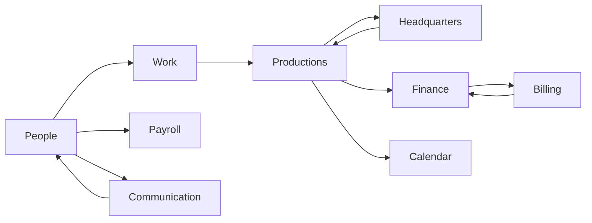
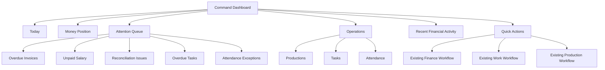
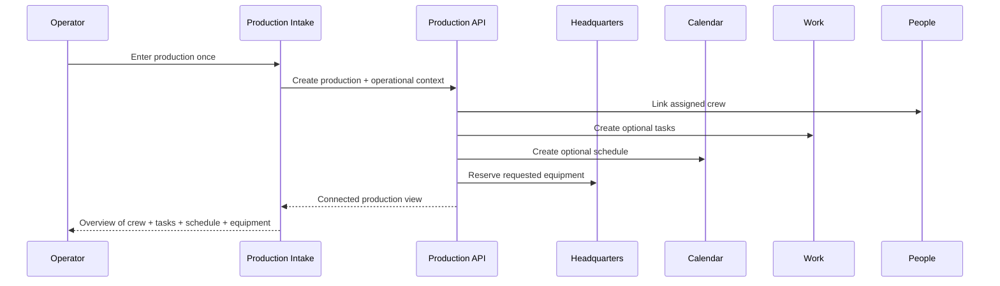
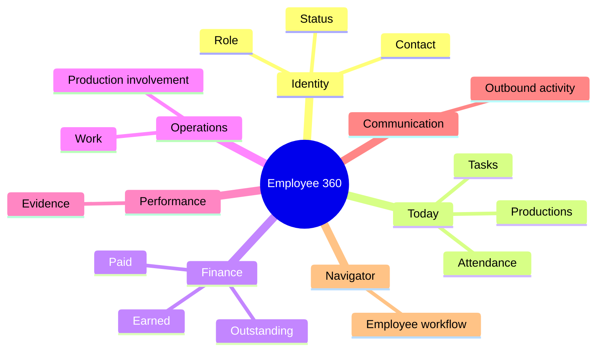
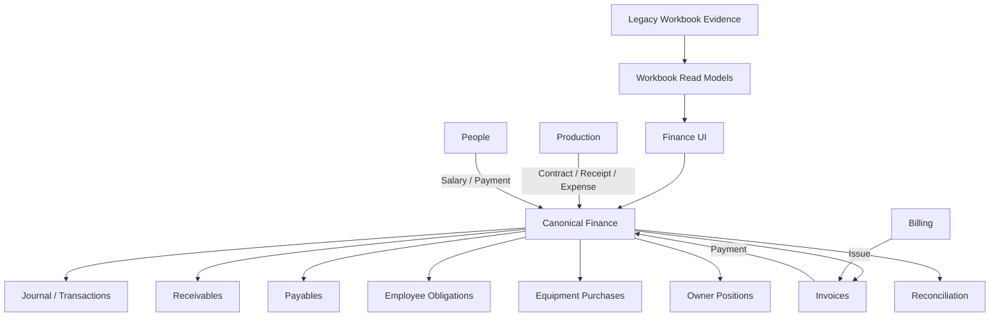
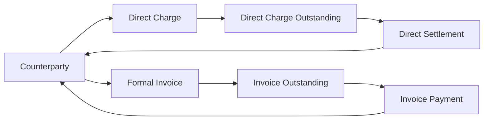
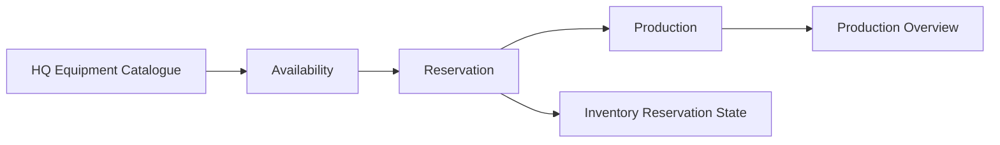
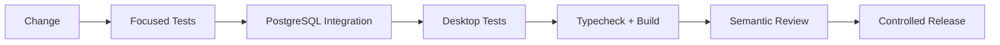

# SA Command

<p align="center">
  
</p>

<p align="center">
  Owner-facing operations software for turning a spreadsheet-heavy production workflow into one connected system.
</p>

<p align="center">
  <sub>Java 21 · Spring Boot · PostgreSQL · React/TypeScript · Tauri 2 · Docker</sub>
</p>

---

## What SA Command actually is

SA Command is being built for the day-to-day operation of **SA Productions**.

The goal is not to turn the business into a generic ERP with hundreds of disconnected screens. The goal is simpler:

> **Enter operational information once, keep it connected, and let the rest of the system follow it.**

A production should not become one row in one place, another row in finance, another set of names in a crew list, and another manual equipment note.

It should become a connected operational object.

```text
                         ┌─────────────────────┐
                         │      PRODUCTION      │
                         │ client · date · job  │
                         └──────────┬──────────┘
                                    │
             ┌──────────────────────┼──────────────────────┐
             │                      │                      │
          PEOPLE                  WORK                 SCHEDULE
        crew / roles         tasks / progress        date / time
             │                      │                      │
             └──────────────────────┼──────────────────────┘
                                    │
                              EQUIPMENT / HQ
                           reservations / stock
                                    │
                                    ▼
                                  FINANCE
                    contracts · receipts · expenses
                    payroll · invoices · settlements
```

The interface is intentionally polished and quiet. The complexity lives in the system, not in the operator's head.

---

## The operating model



The domains are connected, but each domain keeps its own source of truth.

- **People** — employees, attendance, leave, employee 360
- **Work** — tasks, progress, overdue work
- **Productions** — operational jobs, crew, schedule, equipment, notes
- **Headquarters** — equipment catalogue, inventory, reservations and availability
- **Finance** — canonical journal, receivables, payables, payroll obligations, owner positions
- **Billing** — draft → issued → partially paid → paid/cancelled
- **Calendar** — production and operational scheduling
- **Communication** — outbound operational messaging
- **Command** — owner-facing view across the system

---

## Command Dashboard

The Command Dashboard is designed as the owner's morning screen, not as another analytics page.

It answers:

- What is happening today?
- What needs attention?
- What is moving operationally?
- What money moved recently?
- Which existing workflow should I open next?



The dashboard deliberately avoids AI-generated financial severity. Attention states are deterministic and route the operator back into the existing domain workflow.

---

## Production: one intake, connected everywhere

A production is moving toward a **single operational intake**.

The operator can provide the production details together:

- client / title
- date and schedule
- venue / address
- priority
- assigned crew
- operational tasks
- equipment needed
- notes

Crew, tasks, schedule and equipment then become part of the same production context instead of being manually recreated elsewhere.



The production overview is intended to become the command sheet for that job: crew, equipment, schedule, tasks with completion state, finance context, notes and activity — all editable through their existing domain workflows.

---

## People / Employee 360

People is not just an employee table.

The current direction is an **Employee 360** view that connects:



A critical rule is preserved throughout the system:

**earned ≠ paid ≠ outstanding.**

Employee payments are canonical finance postings and can be partial or repeated. The UI requires the operator to explicitly choose the owner account paying out.

---

## Finance

Finance is the most controlled part of the system.

The workbook is treated as business evidence and a source for migration/reconciliation work; the application has a canonical finance layer for live postings.



The important distinction is intentional:

- workbook projections are evidence/read models
- canonical finance is the posting authority
- formal invoices and direct party charges remain separate settlement tracks
- creating equipment is not the same as paying an equipment invoice
- a negative owner position is not automatically treated as a business payable

### Finance surfaces currently covered

| Area | Purpose |
|---|---|
| Productions | contracts, receipts, expenses, production-linked finance |
| Owners | Azeem / Akash positions and transfers |
| Employees | earned, paid, outstanding employee obligations |
| Parties | direct charges, receipts, formal invoices |
| Billing | invoice lifecycle and exports |
| Equipment | purchases and payments |
| Reconciliation | control checks and finance integrity |
| Workbook views | legacy evidence and historical context |

---

## Party 360 + Billing

A party can have two different receivable tracks:



The system does not silently turn a direct charge into an invoice or post both as revenue for the same commercial event.

Party 360 brings the tracks together for presentation while keeping settlement explicit.

---

## Headquarters + equipment

Production equipment is connected to Headquarters inventory rather than being a decorative list on a production.



Assignment is idempotent and inventory-aware. The production view refreshes after a successful reservation so the operational record and HQ availability stay aligned.

---

## What is already in the stack

### Backend

- Java 21
- Spring Boot
- PostgreSQL
- Flyway
- JPA / JDBC where appropriate
- canonical finance posting services
- idempotent financial mutations
- reconciliation controls
- Testcontainers / PostgreSQL integration tests

### Desktop

- React
- TypeScript
- Vite
- TanStack Query
- Tauri 2
- responsive command-oriented workflows

### Design language

SA Command uses a restrained, dark, premium visual language:

- macOS-inspired surfaces
- quiet typography
- high information density without spreadsheet clutter
- subtle pointer interactions
- selective card spotlight / direction-aware hover
- staged motion instead of constant animation
- reduced-motion support
- no neon dashboard overload

The interface should feel expensive; the workflow should feel obvious.

---

## Verification philosophy

The project is deliberately test-heavy around areas where a wrong mutation would be expensive.



Recent feature work has repeatedly used:

- focused backend tests
- PostgreSQL/Testcontainers integration
- desktop component tests
- full frontend test suites where appropriate
- TypeScript/Vite builds
- `git diff --check`
- semantic audits for business-rule drift

---

## Local development

### Requirements

- Java 21 + Maven 3.9+
- Node.js 22+ + npm 10+
- Docker + Compose
- Rust stable + Tauri 2 prerequisites for the native desktop window

### Start

```bash
# PostgreSQL
docker compose up -d postgres

# API
mvn -f apps/backend/pom.xml spring-boot:run

# Desktop
npm --prefix apps/desktop install
npm --prefix apps/desktop run dev
```

Default endpoints:

- API: `http://localhost:8080`
- Desktop/Vite: `http://localhost:1420`

For the native Tauri window:

```bash
npm --prefix apps/desktop run tauri dev
```

---

## Verification commands

```bash
# Backend
mvn -f apps/backend/pom.xml verify

# Desktop tests
npm --prefix apps/desktop test -- --run

# Typecheck + production build
npm --prefix apps/desktop run build

# E2E
npm --prefix apps/desktop run test:e2e
```

PostgreSQL/Testcontainers and browser E2E checks require the corresponding local tooling.

## Demo reset

With the API running in demo mode:

```powershell
powershell -ExecutionPolicy Bypass -File scripts/reset-demo.ps1
```

The reset recreates deterministic demo data for the connected operational domains.

---

## Documentation

- [Architecture](docs/architecture.md)
- [Data model](docs/data-model.md)
- [Payroll ledger](docs/payroll.md)
- [WhatsApp operations](docs/whatsapp.md)
- [Security guide](docs/security.md)
- [Release guide](docs/release.md)
- [Phase 3 checklist](docs/phase-3-checklist.md)
- [Third-party provenance](docs/THIRD_PARTY.md)

---

<p align="center">
  <sub>Built around the way SA Productions actually operates — not around how an ERP template thinks a business should operate.</sub>
</p>
