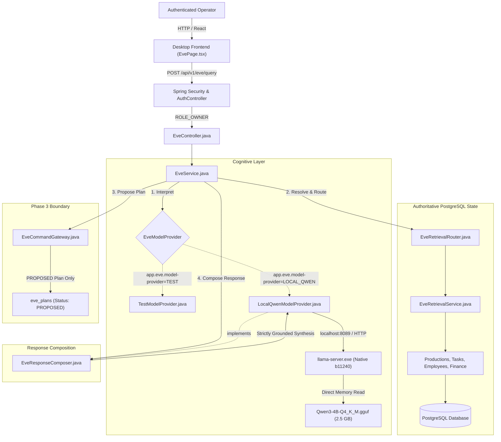

# EVE Phase 5 Implementation Map: Local Model Integration Architecture

This document maps all files, boundaries, contracts, and data flows involved in EVE Phase 5 Local Model Integration (`Qwen3-4B-Q4_K_M.gguf`).

---

## 1. Architectural Overview & Boundaries

---

## 2. File & Component Inventory

### Backend Architecture

| File Path | Component / Role | Phase 5 Responsibility |
|-----------|------------------|------------------------|
| [`LocalQwenModelProvider.java`](file:///c:/Users/xtrar/Desktop/ERP/apps/backend/src/main/java/com/saproduction/command/eve/LocalQwenModelProvider.java) | `EveModelProvider`, `EveResponseComposer` | Native server lifecycle management, bounded inference (`Semaphore(1)`), strict JSON interpretation, grounded response composition. |
| [`EveResponseComposer.java`](file:///c:/Users/xtrar/Desktop/ERP/apps/backend/src/main/java/com/saproduction/command/eve/EveResponseComposer.java) | Natural language synthesis interface | Formulates responses based strictly on domain facts; maintains structural single-method invariant on `EveModelProvider`. |
| [`TestModelProvider.java`](file:///c:/Users/xtrar/Desktop/ERP/apps/backend/src/main/java/com/saproduction/command/eve/TestModelProvider.java) | Deterministic test provider | Active when `app.eve.model-provider=TEST` (default); allows `mvn test` to pass deterministically in seconds. |
| [`EveDtos.java`](file:///c:/Users/xtrar/Desktop/ERP/apps/backend/src/main/java/com/saproduction/command/eve/EveDtos.java) | Data Transfer Objects | Added `EveStatusView` record with runtime diagnostic fields. |
| [`EveController.java`](file:///c:/Users/xtrar/Desktop/ERP/apps/backend/src/main/java/com/saproduction/command/eve/EveController.java) | REST Controller | Added `GET /api/v1/eve/status` endpoint. |
| [`EveService.java`](file:///c:/Users/xtrar/Desktop/ERP/apps/backend/src/main/java/com/saproduction/command/eve/EveService.java) | Domain Orchestrator | Wires grounded response composition and exposes model runtime status. |
| [`EveRetrievalService.java`](file:///c:/Users/xtrar/Desktop/ERP/apps/backend/src/main/java/com/saproduction/command/eve/EveRetrievalService.java) | Entity resolution engine | Added token-level fallback searching and stop-word filtering for colloquial/fuzzy production resolution. |
| [`EveRetrievalRouter.java`](file:///c:/Users/xtrar/Desktop/ERP/apps/backend/src/main/java/com/saproduction/command/eve/EveRetrievalRouter.java) | Intent dispatcher | Handled `GREETING` and `GENERAL_QUERY`; enriched production detail view with crew, tasks, and equipment. |
| [`application.yml`](file:///c:/Users/xtrar/Desktop/ERP/apps/backend/src/main/resources/application.yml) | Configuration | Configured `app.eve.model-provider: ${EVE_MODEL_PROVIDER:TEST}` and `app.eve.local.*` coordinates. |
| [`LocalQwenModelIntegrationTest.java`](file:///c:/Users/xtrar/Desktop/ERP/apps/backend/src/test/java/com/saproduction/command/eve/LocalQwenModelIntegrationTest.java) | Integration Test Suite | Direct testing of `LocalQwenModelProvider` error handling, schema parsing, timeouts, and fallbacks. |

### Frontend Architecture

| File Path | Component / Role | Phase 5 Responsibility |
|-----------|------------------|------------------------|
| [`eve.types.ts`](file:///c:/Users/xtrar/Desktop/ERP/apps/desktop/src/features/eve/eve.types.ts) | TypeScript Models | Added `EveStatusView` interface. |
| [`eve.api.ts`](file:///c:/Users/xtrar/Desktop/ERP/apps/desktop/src/features/eve/eve.api.ts) | API Client | Added `eveApi.getStatus()` method. |
| [`EvePage.tsx`](file:///c:/Users/xtrar/Desktop/ERP/apps/desktop/src/features/eve/EvePage.tsx) | Desktop Command Console | Changed user display role from `"Mamu"` to `"You"`, avatar initial to `"Y"`, added local intelligence status badge. |
| [`EvePage.test.tsx`](file:///c:/Users/xtrar/Desktop/ERP/apps/desktop/src/features/eve/EvePage.test.tsx) | Vitest Component Tests | Added tests for `getStatus()` badge rendering and `"You"` user role assertion. |

---

## 3. Configuration & Runtime Switches

| Environment Variable | Property Name | Default Value | Description |
|----------------------|---------------|---------------|-------------|
| `EVE_MODEL_PROVIDER` | `app.eve.model-provider` | `TEST` | Set to `LOCAL_QWEN` to activate native Qwen3 local inference. |
| `EVE_LOCAL_MODEL_PATH` | `app.eve.local.model-path` | `eve/models/Qwen3-4B-Q4_K_M.gguf` | Absolute or relative path to GGUF model file. |
| `EVE_LOCAL_INFERENCE_PATH` | `app.eve.local.binary-path` | `eve/runtime/llama-server/llama-server.exe` | Path to native llama-server binary. |
| `EVE_LOCAL_MODEL_PORT` | `app.eve.local.port` | `8089` | Localhost port for native inference server. |
| `EVE_LOCAL_THREADS` | `app.eve.local.threads` | `6` | CPU inference threads allocated to llama-server. |
| `EVE_LOCAL_CTX_SIZE` | `app.eve.local.ctx-size` | `2048` | Context window size in tokens. |

---

## 4. Verification Checkpoints

1. **Deterministic CI Boundary**: `mvn test` succeeds without requiring the model file.
2. **Offline Local Intelligence**: In running backend with `EVE_MODEL_PROVIDER=LOCAL_QWEN`, local Qwen3-4B server boots, answers colloquial and multi-turn domain queries, and gracefully falls back on unexpected inputs.
3. **Write Protection**: Governed commands (Phase 3) strictly create `PROPOSED` plans requiring human operator confirmation; zero ledger balance mutations without confirmation.
4. **Git Hygiene**: Neither `Qwen3-4B-Q4_K_M.gguf` nor `eve/runtime/` binaries are tracked in Git.
